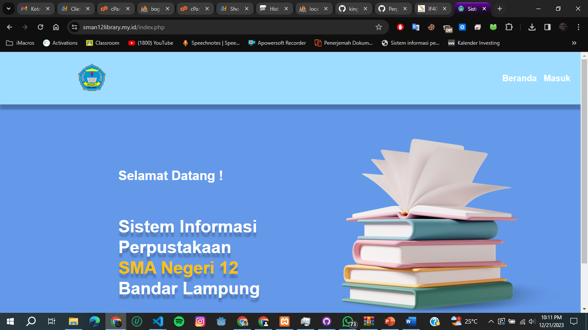

# SISTEM INFORMASI PERPUSTAKAAN SMA NEGERI 12 BANDAR LAMPUNG

## Deskripsi

Perpustakaan merupakan salah satu fasilitas penting yang wajib ada dalam sebuah lembaga pendidikan seperti SMA Negeri 12 Bandar Lampung.
Adanya perpustakaan tidak hanya berfungsi sebagai tempat menyimpan buku, tetapi juga sebagai pusat informasi dan pengetahuan bagi siswa dan staf pendidik.
Oleh karena itu, penting untuk memiliki sistem informasi perpustakaan yang efisien dan terintegrasi guna mendukung operasional perpustakaan secara optimal.

### Fitur

- Peminjaman Buku
- Pengembalian Buku
- Riwayat Peminjaman Buku
- Riwayat Pengembalian Buku
- Denda
- Riwayat Denda
- Notifikasi WhatsApp Otomatis

### Teknologi yang Digunakan

- PHP
- MYSQL
- Javascript

### Tampilan Website


## Cara Instalasi

- Import projek ke komputer
  
```bash
git clone https://github.com/kingjo04/Perpus_SMAN12_BandarLampung
```

```bash
cd Perpus_SMAN12_BandarLampung
```

- Start XAMPP
- Import database sql ke localhost/phpmyadmin
- Buka direktori projek di htdocs untuk menjalankan website di local
